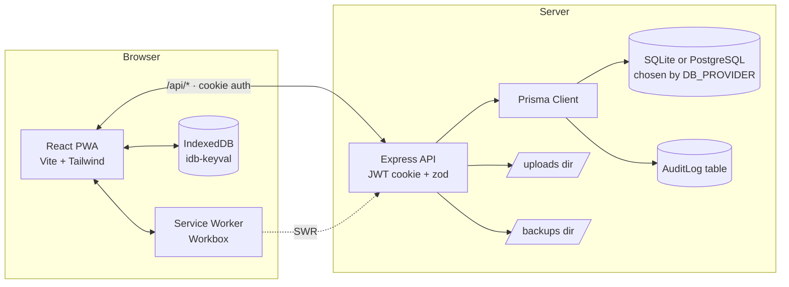

# Gia Phả Việt — Roots of Vietnam

[](LICENSE)
[](#pwa--offline)
[](frontend/src/locales/vi.ts)

An open-source, Vietnamese-first, offline-capable Progressive Web App for keeping a
family tree (gia phả). Built for any Vietnamese household — bring your own
surname, branches, and stories.

- **Frontend** — React 18 · Vite · TypeScript · TailwindCSS · `react-d3-tree` · `vite-plugin-pwa`
- **Backend** — Node 24 LTS · Express · Prisma · SQLite *or* PostgreSQL (selectable via `DB_PROVIDER`)
- **Auth** — JWT in an httpOnly cookie · bcrypt cost 12 · in-memory denylist on logout · login rate-limit
- **Offline** — Workbox (SWR for the API, CacheFirst for `/uploads`) backed by IndexedDB via `idb-keyval`

## Quick start

```bash
pnpm install
cp .env.example .env                   # bootstraps backend + frontend env

# SQLite (default, zero-setup):
pnpm --filter backend migrate          # creates database/roots.db
# …or PostgreSQL (set DB_PROVIDER=postgresql and DATABASE_URL=postgresql://… in .env first):
# DB_PROVIDER=postgresql pnpm --filter backend migrate

pnpm --filter backend prisma:generate  # honors DB_PROVIDER; re-run after switching providers
pnpm seed                              # admin user + 22-person demo family
pnpm dev                               # backend :3001, frontend :5173
```

Open <http://localhost:5173> and sign in with:

| Field    | Value      |
| -------- | ---------- |
| username | `admin`    |
| password | `changeme` |

**Before exposing the service to anyone else**: change `JWT_SECRET` in `.env` and rotate the seed admin password.

The seed ships a generic demo family (Họ Nguyễn) so you can explore the features
straight away. Replace it with your own family by editing the persons through the
UI or rewriting [`backend/prisma/seed.ts`](backend/prisma/seed.ts).

## Repository layout

```text
roots-of-vietnam/
├── frontend/    Vite React app · PWA · Tailwind · react-d3-tree
├── backend/     Express + Prisma. Schemas at backend/prisma/schema.prisma (sqlite)
│                and backend/prisma/postgres/schema.prisma (postgresql) — kept in sync.
├── shared/      Cross-package TypeScript types (Person, Role, …)
├── database/    SQLite file (roots.db) when DB_PROVIDER=sqlite. Untracked.
├── uploads/     Local media. Served at /uploads/*. Untracked.
├── backups/     JSON exports + media zips. Untracked.
├── docker/      docker-compose for one-shot local boot
└── docs/        API.md, SCHEMA.md
```

## Features

### Family data

- **Persons** with full Vietnamese name handling: optional honorific (Cụ, Ông, Bà, Cố),
  diacritic-insensitive search (`nguyen van a` matches `Nguyễn Văn A`), partial dates
  (year-only · month+year · full), and free-text lunar (âm lịch) dates beside the
  solar values.
- **Generations** auto-computed from parents. The editor surfaces a soft warning
  when the recorded generation doesn't match `max(parent.generation) + 1` —
  doesn't block saving.
- **Marriages** support polygamy: a person can appear in multiple `Marriage` rows.
  The tree groups children under their actual parents.
- **Branches** (chi tộc) for partitioning a large clan into named sub-lines.
- **Media** — image / pdf / audio / doc uploads with optional captions.

### Tree

- Vertical / horizontal orientation toggle.
- Default-collapses below 3 generations from the selected root.
- Click a node → profile drawer with inline parents, spouses, children.
- "Xem từ người này" re-roots the tree at any person (also via `?root=<id>` URL).
- Inline `⚭` spouse list and `Chưa rõ cha/mẹ` placeholder badges for unknown parents.

### Security & audit

- JWT in an httpOnly cookie, sliding refresh on `/api/auth/me`.
- bcrypt cost 12, password policy ≥ 10 characters on user-management API.
- 5 failed logins per 15 minutes per IP → `429 Too Many Requests`.
- Role-gated mutations: viewer → read only, editor → person + media, admin → users + backup/restore.
- Cycle guard on parent edges: a 422 with a Vietnamese error if a proposed `fatherId` or
  `motherId` would close an ancestry cycle.
- `AuditLog` table records `auth.login.{success,failure}`, `auth.logout`, person CRUD,
  user CRUD, and backup operations with a JSON before/after diff. Admin-only view at
  `/admin/audit`.

### Backup & restore

- `POST /api/backup` → schema-versioned JSON (`backup-<timestamp>.json`) including a
  SHA-256 of each `Media` file. Rolling 10 most-recent files; older auto-pruned.
- `POST /api/backup/media-zip` → companion binary archive of `uploads/` via the
  system `zip` binary.
- Auto-backup on server start if the newest backup is more than 7 days old.
- `POST /api/backup/restore` (admin) — schema-version check, transactional load,
  refuses to overwrite a non-empty database without `?force=true`, returns
  `missingMedia` for any photos that don't match their recorded hash.

### PWA & offline

- Lighthouse PWA score **100** (measured via `lighthouse@11`; v13+ no longer scores PWA).
- Stale-while-revalidate on `/api/*`, cache-first on `/uploads/*`.
- IndexedDB caches persons / marriages / branches / media / recent-views with a
  `lastSyncedAt` meta record, so a second visit boots offline even if the API is down.
- Cold-start gate "Cần kết nối lần đầu" replaces a blank page when the user has
  zero cached data and no network.
- "Có bản cập nhật mới" toast with a "Tải lại" button when a new service worker
  is ready — never auto-reloads.

## Architecture



## Scripts

Run from the repository root unless noted.

| Script                                          | What it does                                                |
| ----------------------------------------------- | ----------------------------------------------------------- |
| `pnpm dev`                                      | Backend + frontend together via `concurrently`              |
| `pnpm build`                                    | Builds both packages                                        |
| `pnpm seed`                                     | Re-seeds the demo family (idempotent — uses `upsert`)       |
| `pnpm typecheck`                                | Recursive TypeScript checks across workspaces               |
| `pnpm --filter backend migrate`                 | `prisma migrate dev` against the active provider (`DB_PROVIDER`)     |
| `pnpm --filter backend migrate:deploy`          | Apply migrations against a pre-existing database                     |
| `pnpm --filter backend prisma:generate`         | Regenerates the Prisma client to match `DB_PROVIDER`                 |
| `pnpm check:schemas`                            | Fails if sqlite + postgres `schema.prisma` files drift               |
| `cd backend && pnpm exec tsx --env-file=../.env scripts/stress-seed.ts` | Adds a 200-person stress cohort under the thủy tổ |
| `cd backend && pnpm exec tsx --env-file=../.env scripts/prune_test.ts`  | Asserts rolling-10 backup retention                |

## Documentation

- [`docs/API.md`](docs/API.md) — REST API reference.
- [`docs/SCHEMA.md`](docs/SCHEMA.md) — Prisma model + generation rule + cascade behavior.
- [`CONTRIBUTING.md`](CONTRIBUTING.md) — local setup, code style, commit conventions.
- [`SECURITY.md`](SECURITY.md) — supported versions and vulnerability reporting.
- [`CHANGELOG.md`](CHANGELOG.md) — versioned change history.
- [`CODE_OF_CONDUCT.md`](CODE_OF_CONDUCT.md) — community expectations.

## Roles

| Role     | Read | Edit/Create | Delete person | Backup / restore / users |
| -------- | :--: | :---------: | :-----------: | :----------------------: |
| viewer   |  ✓   |             |               |                          |
| editor   |  ✓   |     ✓       |               |                          |
| admin    |  ✓   |     ✓       |       ✓       |            ✓             |

## Docker

```bash
cd docker
docker compose up --build
```

Mounts `database/`, `uploads/`, and `backups/` into the host for persistence.

## What's out of scope (today)

GEDCOM import / export, OCR, real-time multi-user collab, approval workflows,
MySQL adapter, cemetery maps, QR codes, AI features. Phase 3 candidates are
tracked in [`CHANGELOG.md`](CHANGELOG.md#unreleased). (PostgreSQL is now
supported via `DB_PROVIDER=postgresql`.)

## License

MIT — see [`LICENSE`](LICENSE).
