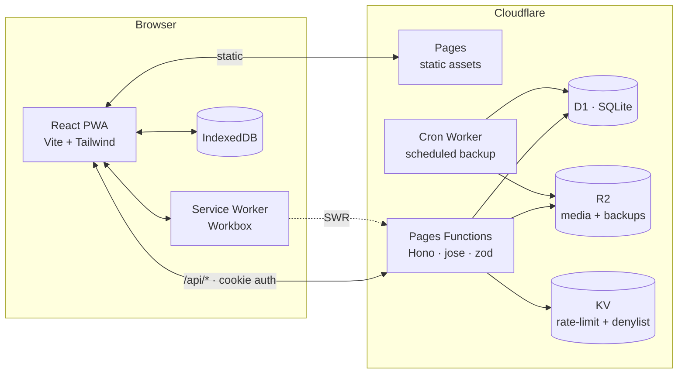

# Gia Phả Việt — Roots of Vietnam

[](LICENSE)
[](#pwa--offline)
[](frontend/src/locales/vi.ts)
[](docs/CLOUDFLARE.md)

An open-source, Vietnamese-first, offline-capable Progressive Web App for keeping a
family tree (gia phả). Built for any Vietnamese household — bring your own
surname, branches, and stories. Runs entirely on **Cloudflare's edge**.

> **Deploy:** provision D1 + KV + R2, then `pnpm cf:deploy`. Full steps in
> [`docs/CLOUDFLARE.md`](docs/CLOUDFLARE.md).

- **Frontend** — React 18 · Vite · TypeScript · TailwindCSS · `react-d3-tree` · `vite-plugin-pwa`, served as static assets by **Cloudflare Pages**.
- **API** — **Hono** on **Pages Functions** (Workers runtime), one file per resource, zod on every input.
- **Database** — **Cloudflare D1** (SQLite) via Prisma 6 + `@prisma/adapter-d1`.
- **Storage** — uploaded media + backups in **R2**; login rate-limit + JWT denylist in **KV**.
- **Auth** — JWT (`jose`, HS256) in an httpOnly cookie · bcrypt cost 12 · KV denylist on logout · login rate-limit.
- **Offline** — Workbox (SWR for the API, CacheFirst for `/uploads`) backed by IndexedDB via `idb-keyval`.

## Quick start (local)

```bash
pnpm install
npx wrangler login

# Provision the bindings once, then paste the returned ids into wrangler.toml:
npx wrangler d1 create roots-of-vietnam
npx wrangler kv namespace create roots-kv
npx wrangler r2 bucket create roots-of-vietnam-media

# Local dev DB + a JWT secret for `wrangler pages dev`:
echo 'JWT_SECRET=local-dev-secret-min-16-chars' > .dev.vars
pnpm cf:build                                   # generate D1 client + build the UI
pnpm migrate:local                              # apply the schema to the local D1
pnpm seed:local                                 # admin/changeme + 22-person demo family

pnpm dev                                         # wrangler pages dev → http://localhost:8788
```

Open <http://localhost:8788> and sign in with:

| Field    | Value      |
| -------- | ---------- |
| username | `admin`    |
| password | `changeme` |

**Before exposing the service**: set a real secret with `wrangler pages secret put
JWT_SECRET` and rotate the seed admin password (via `POST /api/users` or re-seed
with `ADMIN_PASS`). See [`docs/CLOUDFLARE.md`](docs/CLOUDFLARE.md) for production deploy.

The seed ships a generic demo family (Họ Nguyễn) so you can explore straight away.
Replace it with your own family through the UI, or edit [`prisma/seed.mjs`](prisma/seed.mjs).

## Repository layout

```text
roots-of-vietnam/
├── frontend/    Vite React app · PWA · Tailwind · react-d3-tree (served by Pages)
├── functions/   Cloudflare Pages Functions — thin entries that delegate to the Hono app
│   ├── api/[[route]].ts        → /api/*
│   └── uploads/[[route]].ts    → /uploads/* (R2)
├── worker/      The API: Hono app + libs (auth, ratelimit, audit, media, backup) + cron
├── prisma/      D1 schema.prisma + migrations + seed (seed.mjs, seed-admin.mjs)
├── shared/      Cross-package TypeScript types (Person, Role, …)
├── wrangler.toml         Pages config (D1/KV/R2 bindings + vars)
├── wrangler.cron.toml    standalone Cron Worker for scheduled backups
└── docs/        CLOUDFLARE.md (deploy), API.md, SCHEMA.md
```

## Features

### Family data

- **Persons** with full Vietnamese name handling: optional honorific (Cụ, Ông, Bà, Cố),
  diacritic-insensitive search (`nguyen van a` matches `Nguyễn Văn A`), partial dates
  (year-only · month+year · full), and free-text lunar (âm lịch) dates beside the
  solar values.
- **Generations** auto-computed from parents. The editor surfaces a soft warning
  when the recorded generation doesn't match `max(parent.generation) + 1` —
  doesn't block saving.
- **Marriages** support polygamy: a person can appear in multiple `Marriage` rows.
- **Branches** (chi tộc) for partitioning a large clan into named sub-lines.
- **Media** — image / pdf / audio / doc uploads with optional captions, stored in R2.

### Tree

- Vertical / horizontal orientation toggle; default-collapses below 3 generations.
- Click a node → profile drawer with inline parents, spouses, children.
- "Xem từ người này" re-roots the tree at any person (also via `?root=<id>`).

### Security & audit

- JWT (`jose`, HS256) in an httpOnly cookie, sliding refresh on `/api/auth/me`.
- bcrypt cost 12, password policy ≥ 10 characters on the user-management API.
- 5 failed logins per 15 minutes per IP → `429 Too Many Requests` (KV-backed).
- Role-gated mutations: viewer → read only, editor → person + media, admin → users + backup/restore.
- Cycle guard on parent edges: `422` if a proposed `fatherId`/`motherId` would close an ancestry cycle.
- `AuditLog` records login/logout, person/user CRUD, and backup ops with a JSON
  before/after diff. Admin-only view at `/admin/audit`.

### Backup & restore

- `POST /api/backup` → schema-versioned JSON in R2 (`backups/backup-<ts>.json`)
  with a SHA-256 of each media object. Rolling 10; older auto-pruned.
- `POST /api/backup/media-zip` → companion zip of all R2 media (via `jszip`).
- Scheduled auto-backup via a standalone **Cron Worker** (`wrangler.cron.toml`).
- `POST /api/backup/restore` (admin) — schema-version check, refuses to overwrite
  a non-empty database without `?force=true`, returns `missingMedia` for hash mismatches.

### PWA & offline

- Stale-while-revalidate on `/api/*`, cache-first on `/uploads/*`.
- IndexedDB caches persons / marriages / branches / media with a `lastSyncedAt`
  record, so a second visit boots offline even if the API is down.
- "Có bản cập nhật mới" toast with a "Tải lại" button when a new service worker is
  ready — never auto-reloads.

## Architecture



## Scripts

Run from the repository root.

| Script                  | What it does                                                        |
| ----------------------- | ------------------------------------------------------------------- |
| `pnpm dev`              | `wrangler pages dev` — full stack (UI + API + bindings) on :8788    |
| `pnpm dev:web`          | Vite HMR server on :5173, proxying `/api` → :8788                   |
| `pnpm cf:build`         | Generate the D1 Prisma client + build the frontend → `frontend/dist`|
| `pnpm cf:deploy`        | Build + `wrangler pages deploy`                                     |
| `pnpm migrate:local` / `:remote` | `wrangler d1 migrations apply` (local / production D1)     |
| `pnpm seed:local` / `:remote`    | Seed admin + demo family into the local / production D1   |
| `pnpm prisma:generate`  | Regenerate the D1 Prisma client                                     |
| `pnpm prisma:migrate:diff` | Regenerate the D1 migration SQL from the schema                  |
| `pnpm typecheck`        | TypeScript checks across frontend, shared, and the worker           |
| `pnpm test`             | Frontend + component suite (vitest, jsdom)                          |
| `pnpm test:workers`     | API suite vs local D1/KV/R2 (`wrangler getPlatformProxy`)           |
| `pnpm test:e2e`         | Playwright journeys vs `wrangler pages dev`                         |

## Documentation

- [`docs/CLOUDFLARE.md`](docs/CLOUDFLARE.md) — deploy, provisioning, secrets, migrations, seeding.
- [`docs/API.md`](docs/API.md) — REST API reference.
- [`docs/SCHEMA.md`](docs/SCHEMA.md) — data model + generation rule + cascade behavior.
- [`CONTRIBUTING.md`](CONTRIBUTING.md) — local setup, code style, commit conventions.
- [`SECURITY.md`](SECURITY.md) — security model and vulnerability reporting.
- [`CHANGELOG.md`](CHANGELOG.md) — versioned change history.

## Roles

| Role     | Read | Edit/Create | Delete person | Backup / restore / users |
| -------- | :--: | :---------: | :-----------: | :----------------------: |
| viewer   |  ✓   |             |               |                          |
| editor   |  ✓   |     ✓       |               |                          |
| admin    |  ✓   |     ✓       |       ✓       |            ✓             |

## What's out of scope (today)

GEDCOM import / export, OCR, real-time multi-user collab, approval workflows,
cemetery maps, QR codes, AI features.

## License

MIT — see [`LICENSE`](LICENSE).
